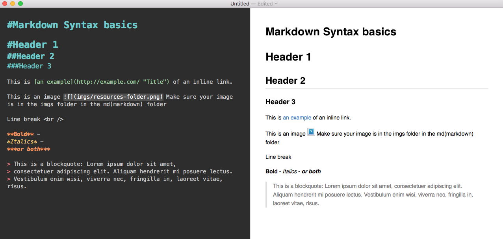

#Markdown Syntax basics 

#Header 1
##Header 2 
###Header 3

This is [an example](http://example.com/ "Title") of an inline link.

Line break  

**Bold** -
*Italics* -
***or both***

> This is a blockquote: Lorem ipsum dolor sit amet,
> consectetuer adipiscing elit. Aliquam hendrerit mi posuere lectus.
> Vestibulum enim wisi, viverra nec, fringilla in, laoreet vitae, risus.

This is an image  Make sure your image is in the imgs folder that is located in the md(markdown) folder. 

For more information see [http://daringfireball.net/projects/markdown/syntax](http://daringfireball.net/projects/markdown/syntax)

This is how footnotes work[^01syntax_1]:
This is how footnotes work[^01syntax_2]:

[^01syntax_1]: You can find them at the end of you .md document! 
[^01syntax_2]: Make sure they are properly numbered! 

