# Manual: How to produce a Theory on Demand

##Contents
 
Introduction 

1\. Prepare your desktop
	
2\. Prepare repository 

3\. Prepare Manuscript 

4\. Make Epub

5\. Make PDF

6\. Publisch TOD

#Introduction

This manual shows you, step by step, how to create a theory on demand. 

For more information about the workflow and creating output for print files, visit the PublishingLab [site](http://www.publishinglab.nl/resources/hybrid-publishing-workflow-faq)

The Hybrid Publishing Toolkit method builds on chapter 6 of the Hybrid Publishing Toolkit book, it relies on a makefile and using the command line.

#1. Prepare your desktop 

### Step 1.1 install all requirements

Before you begin you will need to install:

- text processor (Microsoft Office or Openoffice);
- <a href="https://desktop.github.com/">GitHub Desktop</a> (for working collaboratively);
- markdown editor like <a href="http://macdown.uranusjr.com/">MacDown</a> or XCode (to edit your sourcefiles);
- plain-text editor (like <a href="http://www.sublimetext.com/">Sublime Text</a> or <a href="https://wiki.gnome.org/Apps/Gedit">Gedit</a>);
- install <a href="http://www.adobe.com/nl/creativecloud.html">Adobe Indesign</a>; 
- <a href="http://calibre-ebook.com/download">Calibre</a> (to view/edit ebooks);
- <a href="http://pandoc.org/installing.html">Pandoc</a> (you can install Pandoc with <a href="https://brew.sh/">Homebrew</a>);
- git (for Mac git is included in Xcode, for Windows see <a href="https://git-scm.com/download/win">https://git-scm.com/download/win</a>;
- you will need to familiarise yourself with the command line (terminal
on Mac or go to the Start menu on Windows and type cmd into search/run - more <a
href="http://www.computerhope.com/issues/chusedos.htm">here</a>).

Make sure you login your Github desktop:

	User: dptoolkit@gmail.com
	Pass: amsterdam010 
	
#2 Prepare manuscript 

###Step 2.1  Styling the manuscript inside Word: introducing structural meaning to the text

- Avoid any special characters in the title and number them properly: 01colophone, 02introduction, 03chapter1 etc. 

#3. Prepare repository 
### Step 3.1 Get your git on

Go to [https://github.com/](https://github.com/) and login 

	User: dptoolkit@gmail.com
	Pass: amsterdam010
	
- Create a new repository TOD#;
- Clone the repository to your Github desktop (click set up in desktop);

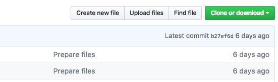

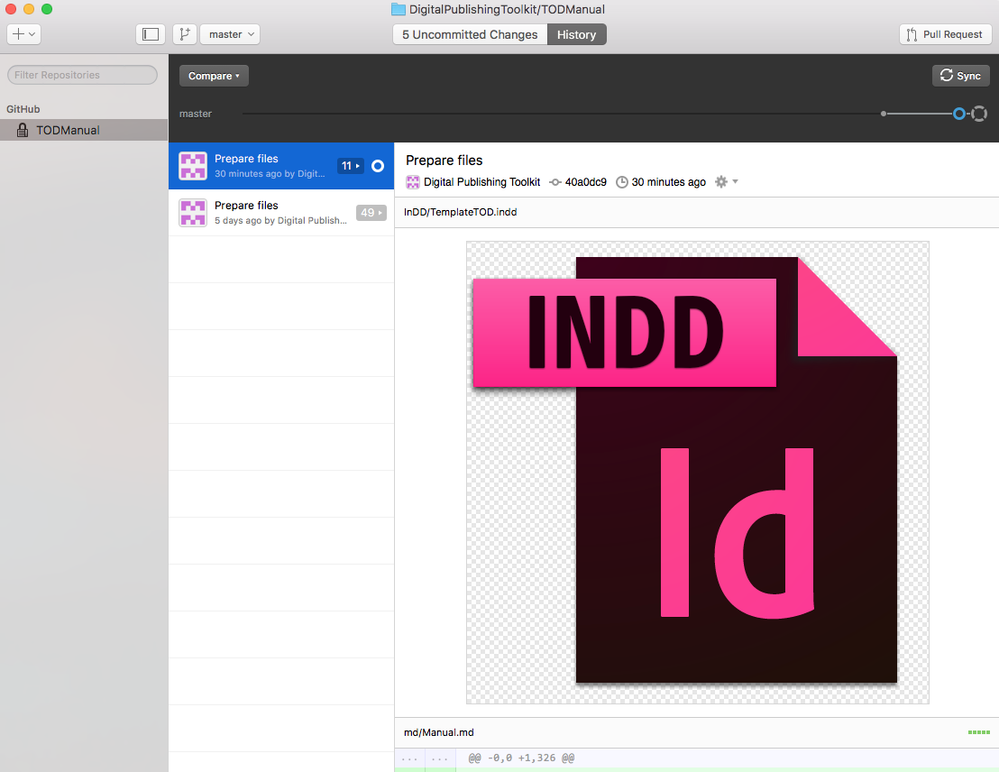

### Step 3.2 Prepare folder // commit to master

Copy folders from this repository (TOD manual) to your own theory on demand repository:

- Make sure you copy all folders and make files.
- Make sure your manuscript(s) are saved as .docx files and move them to the .docx folder, replacing the Test-chapter.docx file.
- Avoid any special characters in the title and number them properly: 01colophone, 02introduction, 03chapter1 etc. 
- Copy all you images in the imgs folder in the md folder 

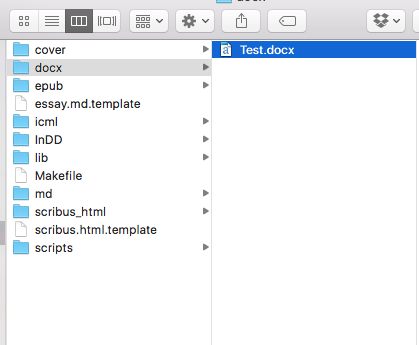
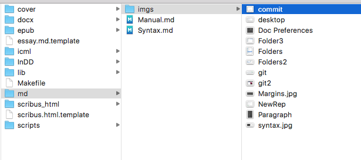

**Avoiding Errors**

- make sure there are no spaces or unusual characters (like %) in file names
- make sure you work with .docx files not .doc
- put any images (.jpg or .png) in the 'imgs' folder inside the markdown folder except the cover
- the cover.jpg image belongs in the epub folder

####MAKE SURE YOU UPLOAD ALL CHANGES TO THE REPOSITORY ON GITHUB.ORG BY CLICKING 'COMMIT TO MASTER' IN THE GITHUB DESKTOP
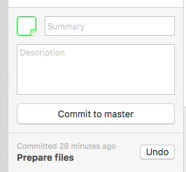

#4 Make Epub 

###Step 4.1 Convert the .docx to a Markdown plain-text file by: 
		
- Use the command line to navigate to the Resources folder (that you renamed). You will need some knowledge of using the command line, you can find help with this <a
href="http://en.flossmanuals.net/command-line/getting-started/">here</a>. You can navigate to that specific folder by typing:

		cd (with a space at end) and dragging and dropping to the terminal the 
		specific folder, and pressing enter.
		
	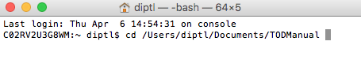

-   After navigating to the right folder, create the source file(s) for your ebook by typing:
		
		make markdowns, and press enter
	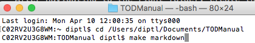

From now on the Markdown will be the working document. It will be here that the changes and corrections will occur. 

### Step 4.2 Edit you .md file(s)

Make sure you check the .md file(s) for any errors or glitches: 

- fill out the meta data at the beginning of your .md file(s). Check with the editor if you have the right metadata information, including the epub isbn number.
Here's more information about <a href="http://www.publishinglab.nl/blog/2015/09/25/metadata-schmetadata-whats-it-good-for/">metadata</a>.
- make sure every H1, H2, footnote etc. is converted correctly
- footnotes appear at the end of you .md file(s) and look like this: 

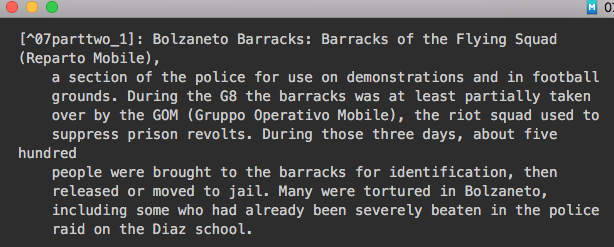

- make sure you add your images manually to the .md file(s) by using the syntax:
		
		

- make sure you name you cover image cover.jpg, and add it to the epub folder

**Most used Syntaxes**
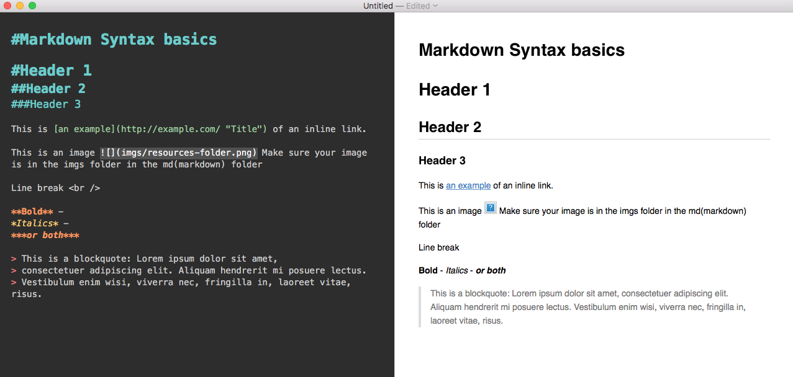

For more examples see [http://daringfireball.net/projects/markdown/syntax](http://daringfireball.net/projects/markdown/syntax)

### Step 4.3 Convert to Epub

Now that you have markdown file(s), you can create an epub: 

- open the terminal and type in command line:

		book.make epub
	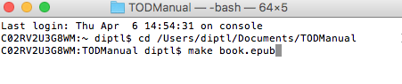

- Check the resources folder to see your book.epub file, which you can open with Calibre or iBooks.

- If you get an error message, there is a useful resource section <a href="http://www.publishinglab.nl/resources/hybrid-publishing-workflow-faq/">here</a> to help you.

### Step 4.4 Design your epub 

A successful ePub has been visually styled (with css and a cover), correctly classified (with metadata), and validated. The epub folder typically has 3 important components:

* the cover image (jpg)
* stylesheet
* metadata file

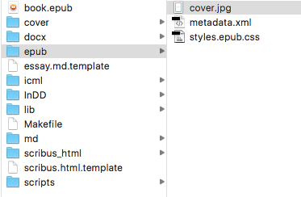

The look of your book is controlled by the styles, you can get color values and typeface suggestions from the print designer. Make sure you embed the fonts you use by including them in the make file and in the lib folder.
Here's more information about <a href="http://www.publishinglab.nl/blog/2015/07/01/epub-typography/">type in epubs</a>.

If you want to change fonts and colors etc. within the epub you need to do this in the styles.epub.css

### Step 4.5 Validating your ePub file

Last, but not least, the developer needs to validate epub to make sure there are no errors that will cause it to be rejected from a retailer or not open correctly for readers:

- You can use the <a href="http://validator.idpf.org/">online
validator</a> for smaller ePubs (under 10MB). The validator will show you where the errors are in your book. See the example below:

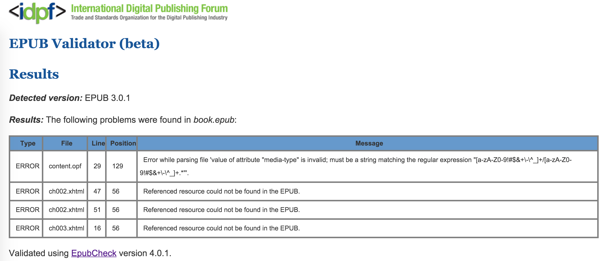

- The error occurs in chapter ch002.xhtml, line 47, there's an explanation that a 'referenced resource is missing', but it helps a lot to edit the book in <a href="http://calibre-ebook.com/download">Calibre</a> and further diagnose that in this case an image is missing.

####MAKE SURE YOU UPLOAD ALL CHANGES TO THE REPOSITORY ON GITHUB.ORG BY CLICKING 'COMMIT TO MASTER' IN THE GITHUB DESKTOP

#5 Make PDF 

### Step 5.1 Create icmls

#6. Publish the book 
How to publisch the theory on demand online

###Step 6.1 Issuu 
- On Issuu the publication should be set with the cover and single pages in one single PDF
- After the cover follows a white page
- In the case the cover is in a different file use Adobe Acrobat to merge the PDF: [http://www.dummies.com/howto/
content/insertinganddeletingpagesinpdfdocumentswith.
html](http://www.dummies.com/howto/
content/insertinganddeletingpagesinpdfdocumentswith.
html)

Go to [http://issuu.com/login?](http://issuu.com/login?) and login as INC:  

	user: info@networkcultures.org
	pass: videovortex

Click on upload: Upload your PDF and fill out the form:   

 - replace the automatically added title;
 - add description (take this from the back cover text); 
 - add date; 
 - click Allow download and leave the visibility on Public.
 - and then Publish!

Now you should be able to see your publication in [http://issuu.com/home/publications](http://issuu.com/home/publications)

###Step 6.2 LULU 

In this case we will need two PDFs: 

- For the inside, we need a single PDF with single pages, without cover. 
- Spreadsheet for the cover (with spine)

Go to [http://www.lulu.com/](http://www.lulu.com/)

		user: margreet@networkcultures.org
		pass: INC05a20

- Click on Creëren / Create and choose Print book On
the next page choose **Premium pocketboek**, then scroll down and choose **Royal** as the format and end
by clicking **‘Dit boek maken’** in the orange arrow:

- Fill in your Title and Author(s) and leave the first options (Lulu, Amazon, Barnes and Nobles) selected 
- Add the ISBN to the publication, **don’t add the barcode**
- Click on Choose File and select your inside PDF, then click on **Upload**
- Click on **“Make PrintReady File”**
- Click on **“advanced onepiece cover designer”**. You will be prompted with all the necessary specs to create the PDF cover. It will be a single sheet having the front cover on the right and the back cover on the left. You can design it using Adobe Illustrator.
- Choose your file and upload it, click **“Save and Continue”**
- Fill the form with the requested info Click **“Save and Continue”**
- Set the price as the minimum suggested by the platform and click on review project
- Finally review your project and then click on **“Save and Finish”**. If you click on the blue title you should see your book for sale on Lulu

###Step 6.3 Upload in INC page
Embed the book on [http://networkcultures.org/](http://networkcultures.org/). In this last part we will create the page for the publication on the INC blog.

Login to [http://networkcultures.org/](http://networkcultures.org/)

- Go over Publications and click on **Add New**; fill the form with title of the book
- Go to the Issuu page relative to the publication and click the **embed button**
- Click on styling option and change the **width to 600**
- Check **“Use on Tumblr, Wordpress or similar”**, click on Save style and then copy the **Embed** code
- Paste the embed code at the top of the content box according to the series, check the correct category. It should look like this: 
			
		[embed]http://issuu.com/instituteofnetworkcultures/docs/issuethelistserveskwerbin?e=3130431/44189048[/embed]

		 

- Add a (small) cover image
- Add colophon info to the Info box
- Don’t add a link in the download area 
- Click on Publish, you should finally see you publication in [http://networkcultures.org/publications/](http://networkcultures.org/publications/)

#Markdown Syntax basics 

#Header 1
##Header 2 
###Header 3

This is [an example](http://example.com/ "Title") of an inline link.

Line break  

**Bold** -
*Italics* -
***or both***

> This is a blockquote: Lorem ipsum dolor sit amet,
> consectetuer adipiscing elit. Aliquam hendrerit mi posuere lectus.
> Vestibulum enim wisi, viverra nec, fringilla in, laoreet vitae, risus.

This is an image  Make sure your image is in the imgs folder that is located in the md(markdown) folder. 

For more information see [http://daringfireball.net/projects/markdown/syntax](http://daringfireball.net/projects/markdown/syntax)

This is how footnotes work[^01syntax_1]:
This is how footnotes work[^01syntax_2]:

[^01syntax_1]: You can find them at the end of you .md document! 
[^01syntax_2]: Make sure they are properly numbered! 

